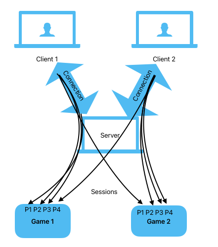
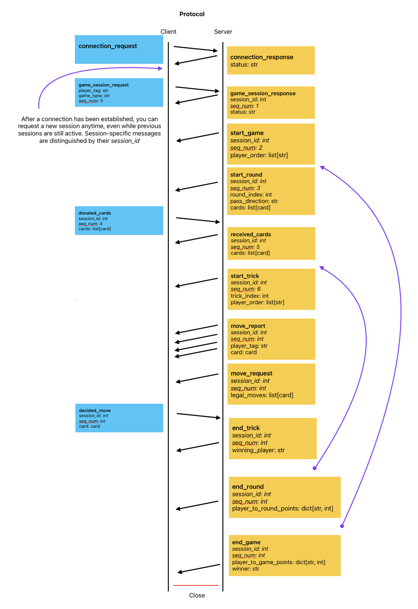

# Implementing a Hearts Player Client

- Rules for the game of hearts can be found [here](https://bicyclecards.com/how-to-play/hearts/)
- Language specific information on client implementations
  - [Python](python/README.md)

## Connections

After a client establishes a TCP connection to the server, they should send the following json formatted message:
```json
{
    "type": "connection_request"
}
```
To confirm the connection, the server will respond with similarly formatted message to confirm the connection:
```json
{
    "type": "connection_response",
    "status": "success"
}
```

## Sessions
Because network latencies slow down the game play, the hearts server allows multiple concurrent "sessions" to be played on a connection.
A session represents one player's spot in one game, and may belong to any connection.

For example, two clients might each have 4 sessions, with 3 playing in one game and 1 playing in the other.


A `game_session_request` message may be sent by the client at anytime after the connection response has been received:
```json
{
    "type": "game_session_request",
    "player_tag": "<name of the player logic>",
    "game_type": "<any|humans_only|bots_only>",
    "seq_num": 0
}
```
The seq_num for this message will always be 0 as it is the first message in the session.

The server will produce:
```json
{
    "type": "game_session_response",
    "session_id": 0,
    "seq_num": 1,
    "status": "success"
}
```
and then wait until the matching engine assigns this session to a game.

The session_id returned by this message should be kept by the client as all future messages for this session sent by either the client or the server will need include this session_id.

## Game Play
The following describes each individual client session's side of the protocol during a single game. In many cases the server will send the exact same message (with differing session ids) to each of the clients. Note that this would happen even if any/all of the players in the game were on the same connection (_its all per session_).
### Game
- `start_game`: Sent at the beginning of the game including the player_tags in their order of play
- *rounds happen here...*
- `end_game`: Sent at the end of the game including info about the end scores (this is also the last message in the session)

### Round
- `start_round`: Sent at the beginning of each round and includes the pass direction as well as the cards in your hand
- `donated_cards`: Should be sent **by the client** (if the round is not a keeper) including the cards they are passing
- `received_cards`: Sent on non-keeper rounds to inform the client of the cards they received
- *tricks happen here...*
- `end_round`: Sent at the end of each round including the scores for the round

### Trick
- `start_trick`: Sent at the beginning of each trick and includes player order
- `move_report`: Sent 4 times in a trick including a player_tag and the move they made
- `move_request`: Will be sent before your move report and includes the legal cards you could play
- `decided_move`: Should be sent **by the client** including the card they are playing
- `end_trick`: Sent at the end of each trick including the player who won the trick

The complete protocol diagram is shown below:

